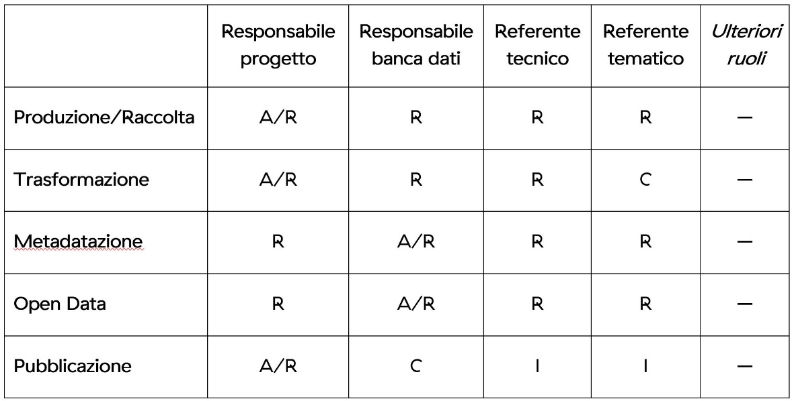

7.1. Informazioni amministrative
********************************

La prima sezione della scheda progetto contiene le informazioni generali
e amministrative relative al progetto, che devono essere definite e rese
accessibili per garantire la corretta gestione della banca dati.
Definisce inoltre la *data governance* del progetto, attribuendo in modo
chiaro le responsabilità sulla base delle Linee guida AgID [6]_.

In alcuni casi, specie negli istituti più piccoli, è possibile che a una
stessa persona vengano attribuite responsabilità multiple.

Di seguito sono elencate le principali informazioni amministrative che
**vanno** descritte nel DMP, con l’indicazione della responsabilità
nella compilazione.

7.1.1. Identificazione del progetto
***********************************

**Nome del progetto** ⓘ: nome del progetto ed eventuale acronimo.

**Codice progetto** ⓓ: al progetto può essere assegnato un
identificatore univoco, in modo da riconoscere con precisione l’identità
del progetto ed evitare possibili ambiguità. **Obiettivi del progetto**
ⓘ: descrizione sintetica degli obiettivi che il progetto intende
raggiungere, evidenziando la coerenza con quanto previsto dal PND.

7.1.2. Ruoli e responsabilità ⓘ
*****************************

**Responsabilità del progetto** ⓘ: indicazione dei nominativi delle
persone che rivestono i vari ruoli definiti (responsabile del progetto,
responsabile della banca dati, responsabile tecnico della banca dati,
responsabile tematico della banca dati, responsabile open data, *digital
data curator*).

**Ulteriori ruoli di gestione dei dati** ⓘ: indicazione dei nominativi
degli ulteriori ruoli e responsabilità previsti nella gestione dei dati
e metadati del progetto. In relazioni alle varie fasi in cui si articola
il progetto, può inoltre essere utile descrivere le responsabilità dei
vari ruoli in maniera sintetica tramite una matrice cosiddetta “RACI”,
come segue:

-  **Responsible (R):** coloro che lavorano per eseguire un determinato
   compito. Esiste almeno un ruolo di responsabile.

-  **Accountable (A):** il solo che può approvare il corretto
   completamento di un compito e che delega il lavoro ai responsabili.
   Può esistere un solo ruolo *accountable* per uno specifico compito.

-  **Consulted (C):** coloro che possono essere consultati in quanto
   esperti di dominio e con i quali instaurare una comunicazione
   bidirezionale.

-  **Informed (I):** coloro che devono essere tenuti aggiornati sui
   progressi del processo, spesso al termine dello stesso.

La Tabella 1 riporta un esempio di possibile matrice RACI. In generale,
le responsabilità assegnate varieranno a seconda delle specificità del
progetto.

|image0|

*Tab. 1 – Esempio di matrice dei ruoli e responsabilità (RACI)*

.. _section-1:

.. [6] Linee guida nazionali per la valorizzazione del patrimonio
   informativo pubblico, “Aspetti organizzativi e qualità dei dati”.
   Agenzia per l’Italia Digitale. 2017.
   `<https://docs.italia.it/italia/daf/lg-patrimonio-pubblico/it/stabile/aspettiorg.html>`_

