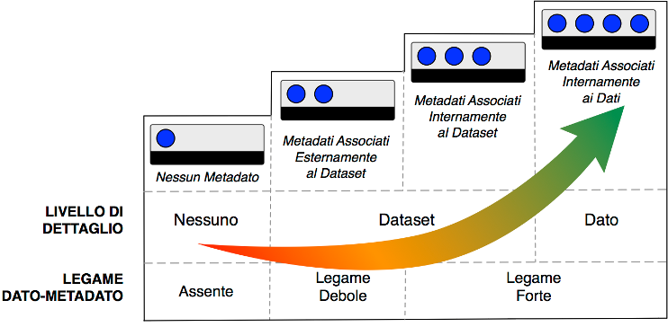

Metadati
========

I metadati sono informazioni strutturate che descrivono collezioni di
dati attraverso vocabolari controllati condivisi da una comunità per
domini di conoscenza specifici; supportano il modello, la comprensione e
la gestione di altri dati e informazioni. La descrizione dei dati e la
documentazione dei tipi di metadati utilizzati (amministrativi,
semantici, descrittivi, tecnici e strutturali) deve essere accompagnata
dalla documentazione e da riferimenti precisi agli standard e alle
metodologie applicate per i vocabolari di dominio a sostegno
dell’interoperabilità e delle normative di riutilizzo.

In questo modo, il DMP documenterà tutte le decisioni relative ai
metadati del progetto, consentendo di rendere i dati riutilizzabili in
futuro, sia da chi li ha prodotti sia da chi li riusa. Di seguito sono
segnalati gli aspetti relativi ai metadati che vanno descritti nel DMP.
Di fianco al nome di ogni campo è indicata la responsabilità nella
compilazione.

Livello di metadatazione ⓘ
--------------------------

Le linee guida AgID prevedono quattro possibili livelli di
metadatazione [1]_, come descritto nella Fig. 1. Si consiglia di
adottare il livello più alto che è tecnicamente possibile implementare.
Il primo livello non include metadati, ed è quindi fortemente
sconsigliato. Il secondo e il terzo livello hanno esclusivamente
metadati associati al dataset, mentre il quarto livello prevede metadati
associati internamente al dato stesso.

|image0|

*Fig. 1 – Livelli di metadatazione
(fonte:*\ `https://docs.italia.it/italia/daf/lg-patrimonio-pubblico/it/stabile/_images/Metadati.png <https://docs.italia.it/italia/daf/lg-patrimonio-pubblico/it/stabile/_images/Metadati.png)>`__\ *)*

Metodologie per la metadatazione ⓘ
----------------------------------

Nel DMP sono descritte le metodologie di metadatazione, specificando in
che modo vengono prodotti i metadati e chi ne è responsabile. Per
ulteriori informazioni si rimanda a quanto contenuto nelle *Linee guida
per la digitalizzazione del patrimonio culturale* e ai regolamenti o
prassi in vigore nella comunità scientifica di riferimento.

Standard di metadatazione ⓘ ⓒ
-----------------------------

Il risultato delle precedenti tappe del modello operativo si traduce
nella produzione di metadati che certificano le caratteristiche del
dato. Come detto precedentemente, la metadatazione, sia dei singoli dati
che degli interi dataset, è cruciale: una delle problematiche più
diffuse relative ai dati del MiC è la molteplicità di copie disponibili
di una stessa informazione, senza che sussista la necessaria certezza
sulle caratteristiche e sulla validazione di ciascun rilascio.

Nel DMP è opportuno descrivere tutti gli standard di riferimento che
sono stati adottati per la metadatazione. Inoltre, un altro elemento
significativo potrebbe essere la descrizione dei formati di codifica che
sono stati utilizzati, facendo riferimento al capitolo 3 delle *Linee
guida per la digitalizzazione del patrimonio culturale*. In particolare,
per i metadati è opportuno seguire lo standard XML/METS (*Metadata
Encoding and Transmission Standard*), che codifica i metadati
descrittivi, amministrativi, tecnici e strutturali riguardanti le
risorse digitali.

.. [1] https://docs.italia.it/italia/daf/lg-patrimonio-pubblico/it/stabile/modellometadati.html#livelli-del-modello-per-i-metadati

